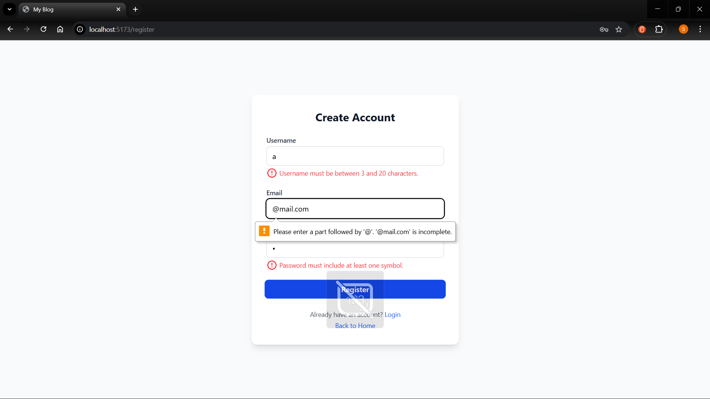
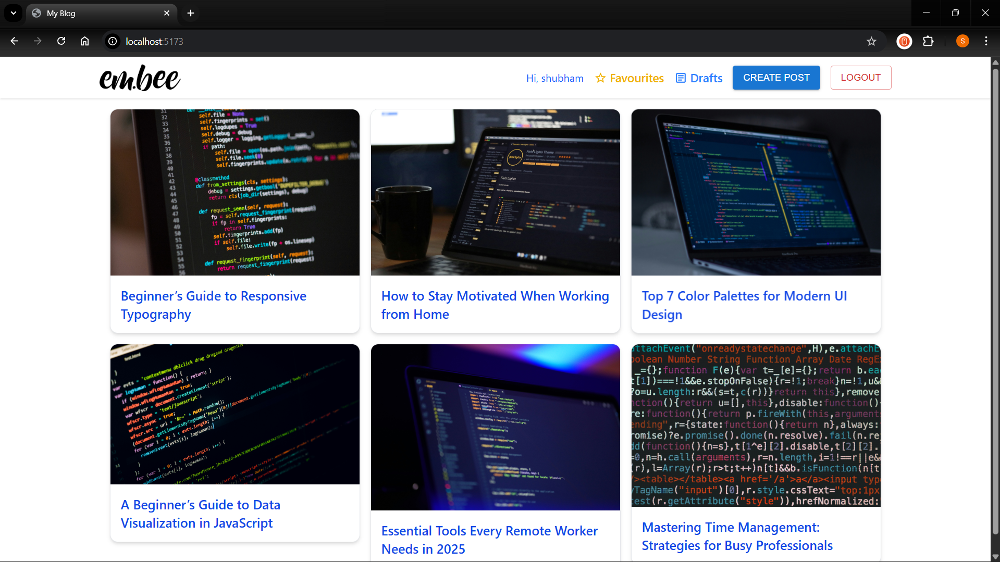
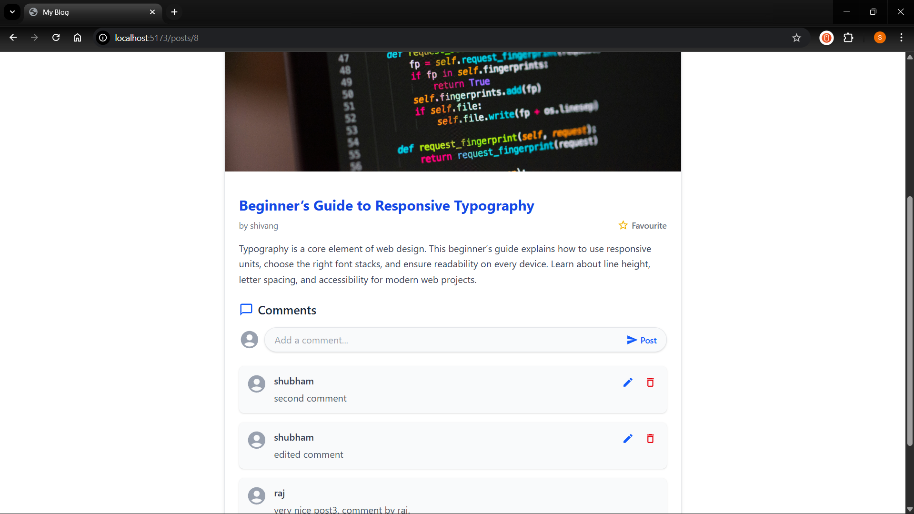
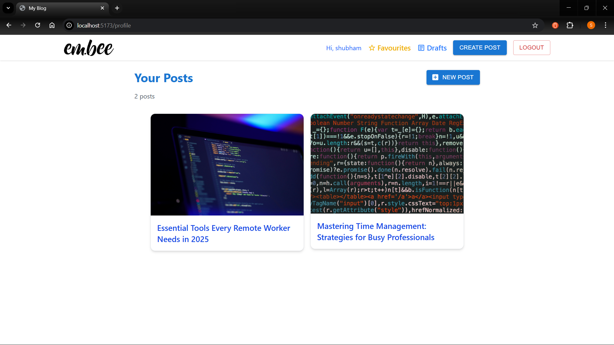

# Embee

Embee is a modern blogging application that allows users to create, edit, and manage posts, drafts, and comments efficiently. Users can publish drafts, mark posts as favourites, and interact seamlessly with content in a secure environment. The platform focuses on delivering a smooth user experience while providing essential blogging functionalities.

---

## Tech Stack

- **Frontend:** React, Vite  
- **Backend:** PHP  
- **Database:** MySQL  
- **Server:** WAMP Server

---

## Features

- **User Authentication:** Secure registration, login, and logout.  
- **Posts CRUD:** Create, read, update, and delete posts.  
- **Drafts CRUD:** Create, edit, publish, and delete drafts.  
- **Comments CRUD:** Add, edit, and delete comments on posts.  
- **Favourites:** Mark and unmark posts as favourites.  
- **Responsive Design:** Fully responsive UI for desktop and mobile screens.

---

## Screenshots & Demos

### Authentication

- **Registration with Robust Validation**  
    

- **Login**  
  [Login.mp4](screenshots/Login.gif)  

- **Logout**  
  [Logout.mp4](screenshots/Logout.mp4)  

- **Without Login User Can Just Read**  
  [WithoutLoginUserCanJustRead.mp4](screenshots/WithoutLoginUserCanJustRead.mp4)  

---

### Posts

- **All Posts on Main Page**  
    

- **Post Details Page Showing Post Content, All Comments, and Option to Mark Favourite**  
    

- **Create and Edit a Post**  
  [EditAPost.mp4](screenshots/EditAPost.mp4)  

- **Delete Own Post**  
  [DeleteOwnPost.mp4](screenshots/DeleteOwnPost.mp4)  

- **Mark as Favourite**  
  [MarkAsFavourite.mp4](screenshots/MarkAsFavourite.mp4)  

- **Unfavourite a Post**  
  [UnfavouriteAPost.mp4](screenshots/UnfavouriteAPost.mp4)  

---

### Drafts

- **Create a Draft**  
  [CreateADraft.mp4](screenshots/CreateADraft.mp4)  

- **Edit a Draft and Delete a Draft**  
  [EditADraftAndDeleteADraft.mp4](screenshots/EditADraftAndDeleteADraft.mp4)  

- **Publish a Draft**  
  [PublishingADraft.mp4](screenshots/PublishingADraft.mp4)  

---

### Comments

- **Create and Edit a Comment**  
  [CreateAndEditComment.mp4](screenshots/CreateAndEditComment.mp4)  

- **Delete Own Comment**  
  [DeleteOwnComment.mp4](screenshots/DeleteOwnComment.mp4)  

---

### Profile

- **Profile Page**  
    

---

### Responsive Design

- **Responsive Layout Demonstration**  
  [Responsive.mp4](screenshots/Responsive.mp4)  

---

